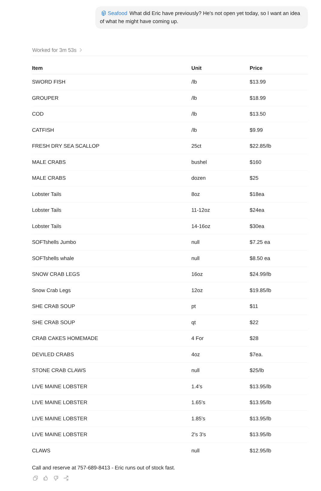

# Seafood Menu Skill

A Claude Code skill for retrieving the latest seafood menu posted by **Beach N Seafood** on Facebook.

The skill uses Playwright to inspect recent Facebook posts, identify the appropriate menu-board post, and return the menu as a simple table.



## Usage

### Get today's menu

Run the skill without additional instructions:

```text
/seafood
```

The skill looks for a menu posted **today** and returns available items in this format:

| Item          | Unit  | Price  |
| ------------- | ----- | ------ |
| Example Item  | lb    | $12.99 |
| Example Clams | 50ct  | $25    |
| Example Clams | 100ct | $45    |

When a current menu is available, the result also includes the phone number for reserving seafood.

If Eric has not posted today's menu yet, the skill will tell you that the menu has not been updated.

On Monday and Tuesday, the skill accounts for Beach N Seafood normally being closed.

## Get the previous menu

You can also ask for the most recently posted menu regardless of whether it was posted today:

```text
/seafood What did Eric have previously?
```

Other natural variations work as well:

```text
/seafood Show me the previous menu
```

```text
/seafood What was his last menu?
```

```text
/seafood previous
```

In this mode, the skill ignores the normal current-date requirement and finds the newest available menu-board post.

This is useful when Eric is closed today, has not posted today's menu yet, or you simply want to see what was recently available.

## How it works

The skill uses a bundled Playwright helper to:

1. Open the Beach N Seafood Facebook page.
2. Capture the most recent Facebook posts.
3. Visually determine which post contains the requested menu.
4. Inspect the selected menu-board image at higher resolution.
5. Extract the seafood items, units, and prices.

The skill intentionally reads the **photographed menu board itself** rather than relying on search results, old menus, third-party websites, or remembered prices.

## Requirements

The skill requires Node.js and a globally available Playwright installation.

## Notes

Menu extraction is intentionally conservative. The skill does not normalize units, infer unclear prices, or guess based on typical seafood pricing.

For example, `/lb`, `qt`, `50ct`, `100ct`, and `dozen` are preserved as written on the board.
